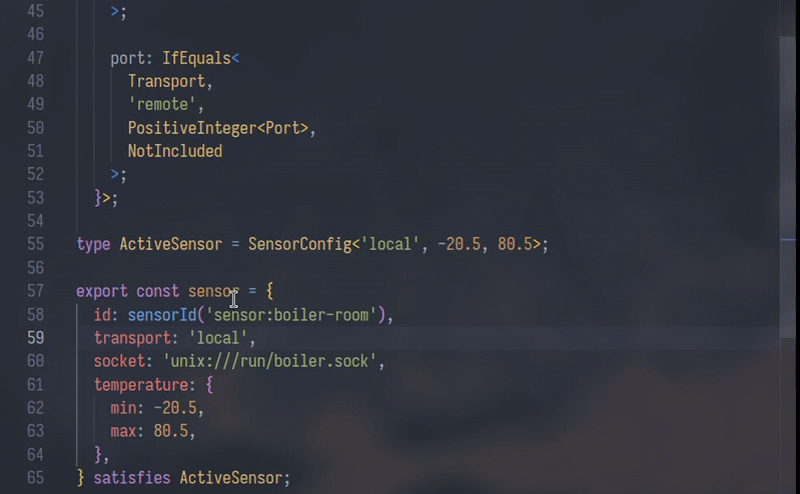

# typyx

<p align="center">
  <a href="./assets/demo.gif">
    
  </a>
</p>

## Overview

This library is a set of 150+ composable type-level primitives that exists purely for type-level metaprogramming.

Used to build SDKs, schema systems, configuration engines, frameworks, typed DSLs, query builders, or any other library with an API that needs frictionless type inference/ergonomics.

These are just plain TS types that you assemble into larger types. No runtime code here.

You may be familiar with [`type-fest`](https://github.com/sindresorhus/type-fest), [`ts-toolbelt`](https://github.com/millsp/ts-toolbelt), [`ts-essentials`](https://github.com/ts-essentials/ts-essentials), [`utility-types`](https://github.com/piotrwitek/utility-types), and more.

So why does this exist? 

Because none of them fit my worfklow.

Because `Type-Fest` is too generic (serves the entire TS developer pool), and because `ts-toolbelt` is ancient, supports older TS (3.8+ / 4.x) and uses this weird nomenclature: `O.Merge` / `L.Concat`, and more.

I've been building TypeScript apps and libraries for years at this point, kept running into some increasingly weird type-level problems that I can't Google or LLM my way out of. 

Eventually, I made this.

Some of these libraries contain equivalents to individual types in here.

That's unavoidable, afterall I didn't invent [`Zip<N,M>`](https://docs.python.org/3.3/library/functions.html#zip) or [`Equals<U,V>`](https://stackoverflow.com/questions/68961864/how-does-the-equals-work-in-typescript).

Some foundational types are here simply because importing another entire package for one primitive, such as `DeepOmit<T, O>`, wouldn't make sense.

Other types in here don't even exist elsewhere at all (more below).

Also, I may note that most utility libraries are collections of finished helpers. Someone needs a type, contributes it, and the collection grows horizontally. And over time, the package becomes a broad catalog made to cover as many unrelated projects and use cases as possible.

This is just a vertically integrated type-system that only I use. 

Every type in here solves at least one problem I encountered throughout the years.

The library builds itself from its own primitives. 

The same primitives are then used to test the library, are also being turned into dedicated testing infrastructure for my other packages, and are used by those packages to construct their own public APIs that use this package.

<details>
<summary><strong>Let me walk you through some use cases.</strong></summary>

<br/>

Let's start with a very simple and small example:

At some point I needed a string that could independently enforce a prefix, something somewhere in the middle, and a suffix. 

`EnforcedString<P,M,S>` does it:

Say you're mapping CSS variables:

```ts
import type { EnforcedString } from 'typyx';

type CssVar = EnforcedString<'--'>;

const color: CssVar = '--color-primary'; // valid
const invalid: CssVar = 'color-primary'; // error
```

Maybe you need a substring constraint instead:

```ts
type I18nKey = EnforcedString<string, '.'>;

const label: I18nKey = 'button.label'; // valid
const invalid: I18nKey = 'buttonlabel'; // error
```

Or all three:

```ts
type LocaleKey = EnforcedString<'i18n.', '.', '.label'>;

const label: LocaleKey = 'i18n.button.label'; // valid
const invalid: LocaleKey = 'button.label'; // error
```

Then there are boolean operators and type-level control flow: `And`, `Or`, `Not`, `Xor`, `Nand`, `Nor`, `Xnor`, `Xand`, `If`, `IfEquals`, and `IfExtends`.

They operate directly on boolean types and compose with the predicate layer.

```ts
import type {
  And,
  If,
  IsNever,
  IsString,
  Not,
  StringifyPrimitive,
} from 'typyx';

type IsValidInput<T> = And<IsString<T>, Not<IsNever<T>>>;

type Serialize<T> = If<
  IsValidInput<T>,
  T,
  StringifyPrimitive<T>
>;
```

But you're probably familiar with `IfEquals`. So what's special?

It can be combined with `NotIncluded` and `Prune`.

One time I was building a hyper-complex dispatch system and ran into a problem where configuration shapes depended on multiple axes at once.

If it's one discriminant, just use a union, but 3 different settings changing 3 different regions of the same object becomes a giant union very quickly.

Say you have 3 environments, 3 isolation strategies, and 3 schedule modes.

That's already 27 possible combos.

You can enumerate all 27 object types manually with unions. It would work, kind of.

Or you declare the rules and let the compiler derive the final shape:

```ts
import type { IfEquals, NotIncluded, Prune } from 'typyx';

type Environment = 'wasm' | 'container' | 'native';
type Isolation = 'none' | 'cgroup' | 'vm';
type Schedule = 'cron' | 'immediate' | 'manual';

type JobConfig<
  Env extends Environment,
  Iso extends Isolation,
  Sched extends Schedule,
> = Prune<{
  execution: IfEquals<
    Env,
    'wasm',
    {
      memoryPages: number;
      importedModules: string[];
    },
    IfEquals<
      Env,
      'container',
      {
        image: string;
        runtime: 'runc' | 'gvisor';
      },
      NotIncluded
    >
  >;

  isolation: IfEquals<
    Iso,
    'none',
    NotIncluded,
    {
      quota: IfEquals<
        Iso,
        'cgroup',
        {
          cpuShares: number;
          memoryLimitBytes: number;
        },
        NotIncluded
      >;
    }
  >;

  schedule: IfEquals<
    Sched,
    'cron',
    {
      expression: string;
      timezone: string;
    },
    IfEquals<
      Sched,
      'immediate',
      {
        priority: number;
      },
      NotIncluded
    >
  >;
}>;

type WasmCronNoIsolation =
  JobConfig<'wasm', 'none', 'cron'>;

const job: WasmCronNoIsolation = {
  execution: {
    memoryPages: 256,
    importedModules: ['env', 'wasi_snapshot_preview1'],
  },
  schedule: {
    expression: '*/5 * * * *',
    timezone: 'UTC',
  },
};
```

The final type has no isolation key.

No `isolation?: never`, nor `isolation?: undefined`. It just doesn't exist, so it doesn't pollute autocomplete or leak an impossible field into the validators.

This is basically how this grew.

A predicate can feed into a boolean operator, which feeds into `If`. `IfEquals` can resolve a field to `NotIncluded`. `Prune` can remove that field from the final object entirely.

Numeric and string constraints can exist directly inside those computed shapes as you saw in the demo.

Tuple operations can produce unions that are consumed by object transforms. A failure can return a readable payload too.

Speaking of which.

Say you want tuple uniqueness but still want a meaningful error payload instead of a vague `never`.

```ts
import type { UniqueArray } from 'typyx';

type Good = UniqueArray<[1, 2, 3]>;
// readonly [1, 2, 3]

type Bad = UniqueArray<[1, 2, 1]>;
// readonly [1, 2, 'Encountered duplicate element', 1]
```

Why is this?

For instance, I recently released [`envyx`](https://github.com/rccyx/envyx), an environment checking library built on this foundation.

In `envyx` I have this type:

```ts
type NoDuplicateIgnoredKeys<Ignored extends IgnoreValidationInputShape> =
  Ignored extends readonly unknown[]
    ? NoTupleDuplicates<
        Ignored,
        'Duplicate ignored environment variable'
      >
    : unknown;
```

I'm using `NoTupleDuplicates` to detect duplicate ignored environment variables.

And `UniqueArray` is used directly in the public API:

```ts
/**
 * Local variable names that should be read without `prefix`.
 */
disablePrefix?: UniqueArray<DisabledKeys>;
```

So if that option is a tuple, I can reject duplicate keys before anything reaches runtime.

This type comes in handy, say you're writing a query builder, for example:

```ts
type QueryBuilder<Columns extends readonly string[]> = {
  select: Columns & NoTupleDuplicates<Columns, 'Duplicate column selected'>;
};

function select<C extends readonly string[]>(columns: QueryBuilder<C>['select']) {}

// works!
select(['id', 'email', 'created_at']);

// Type Error: Property 'Duplicate column selected: email
select(['id', 'email', 'created_at', 'email']);
```

`envyx` also pulls in base everyday utilities `EmptyObject`, `NonEmptyArray`, `Simplify`, `UnionToIntersection` and non everyday utilties like `UnionToTuple`, which is often warned against, because union member ordering isn't guaranteed by the compiler. This is technically right (about order), but, when working with object keys, order doesn't matter, DX and zero duplication do.

In the library, without `UnionToTuple`, users disabling prefixes would have to manually duplicate string keys in a literal array, which is workable when working with 2 keys:

```ts
const serverVars = { DATABASE_URL: z.url(), SECRET: z.string() } as const;

// key duplication: annoying, drifts easily
disablePrefix: ['DATABASE_URL', 'SECRET']
```

But in a modern monorepo, you'd have at least 20. So would go and manually supply every key?

With `UnionToTuple<T>`, envyx provides a lightweight `keys()` helper (`return Object.keys(s) as UnionToTuple<keyof Schema>`) to derive those keys automatically at both runtime and compile time:

```ts
// zero duplication
disablePrefix: keys(serverVars)
```

`EmptyObject` as simple and mundane as it is, is quite useful, and I use it everywhere.

In many codebases `{}` is used an empty object which is actually `Record<string, never>`, which confuses people, but it actually means any value you can look up properties on, so it's `NonNullable<unknown>`.

Small things like this matter.

Speaking of small things.

With `type-fest`, if you want a basic branded type, you're forced into an over-engineered Tagged system.

I just want to enforce nominal typing for a string or number, I don't want or need any of this.

> Usually in the TS/JS ecosystem it's called Branded or Opaque types. I called it `NewType` based on [Python's `NewType`](https://docs.python.org/3/library/typing.html#newtype).

A known use case is to use it to differentiate `UserId` from `OrderId` (both strings) where object ordering won't save you from same parameter transposition at compile time.

But I had this problem once:

JavaScript has no distinct runtime value for an operation that intentionally produced no value.

A function that returns nothing (typed `void` in TS) and a function that explicitly returns `undefined` both end up as `undefined` at runtime.

Sometimes those are different states, which we need to track.

Say you're tracking values across a functional pipeline. You may need to drop an internal unit result while preserving an explicitly supplied `undefined` as actual data.

A private symbol/sentinel value can mark the distinction at runtime, while `NewType` preserves the same distinction at compile time:

```ts
const NO_VALUE = Symbol('internal:no-value');

type NoValue = NewType<'NoValue', void>;

type R<T> = {
  value: T;
  [NO_VALUE]?: true;
};

const unit: R<NoValue> = {
  value: undefined as NoValue,
  [NO_VALUE]: true,
};

const explicitUndefined: R<undefined> = {
  value: undefined,
};
```

Both contain `undefined`, but they're no longer interchangeable.

Some problems may entail that you should have a configuration with numbers like: `PositiveInteger`, `NegativeInteger`, `PositiveFloat`, `NegativeFloat`, `PositiveRange`, `Odd`, `Even`, and string equivalents such as `NegativeFloatString<'-82739.283293237'>`.

This works (non recursive):

```ts
import type { IsNegative } from 'typyx';

type Result = IsNegative<10000000000000000000000000000>;
// false
```

`Odd` and `Even` exist almost everywhere though, added here for convenience:

```ts
import type { Odd } from 'typyx';

function takesOdd<N extends number>(value: Odd<N>) {}

takesOdd(3); // valid
takesOdd(4); // error
```

But anyway, you might want to check the docs.

</details>

## Installation

This is a types only library, there's no JS in the final bundle, so pass the `--save-dev` or `-D` flag:

**npm**

```bash
npm i -D typyx
```

**pnpm**

```bash
pnpm i -D typyx
```

Releases are OIDC signed and published through [GitHub Actions](./.github/workflows/on-workflow-call-release.yml) with npm [provenance.](https://github.blog/security/supply-chain-security/introducing-npm-package-provenance/)

> [!IMPORTANT]
> Requires TypeScript `v5.0+`. Every type here is compile-time tested in [CI](/.github/workflows/on-workflow-call-test.yml) from 5.0 through 6.0 on every push.

## Documentation

Check out the full [API reference](https://typyx.rccyx.com/) for detailed usage examples and docs.

## Types

The best way to understand how these types work (aside from docs) is to check how they're  [tested](/tests/).

### Object shape, keys, and modifiers

* [`Assign<Obj, ObjArr>`](https://typyx.rccyx.com/types/Assign.html) - Copies all enumerable own properties from one target object to a source array of objects.
* [`FilterBy<Obj, P>`](https://typyx.rccyx.com/types/FilterBy.html) - Filters keys from the object type `Obj` based on a specified predicate `P`.
* [`Flip<Obj>`](https://typyx.rccyx.com/types/Flip.html) - Flips the keys and values of an object type `Obj`.
* [`ImmutableKeys<Obj>`](https://typyx.rccyx.com/types/ImmutableKeys.html) - Retrieves the `readonly` keys from an object type `Obj`.
* [`Keys<T>`](https://typyx.rccyx.com/types/Keys.html) - Retrieves the union of keys of a type `T`.
* [`KeysOfUnion<T>`](https://typyx.rccyx.com/types/KeysOfUnion.html) - Extracts the union of keys from a union of object types.
* [`KeysToValues<Obj>`](https://typyx.rccyx.com/types/KeysToValues.html) - Creates a reverse mapping from values to keys for a simple object type.
* [`MakeOptional<T, K>`](https://typyx.rccyx.com/types/MakeOptional.html) - Makes the specified keys `K` optional while preserving the original modifiers of all other keys.
* [`MakeRequired<T, K>`](https://typyx.rccyx.com/types/MakeRequired.html) - Makes the specified keys `K` required while preserving the original modifiers of all other keys.
* [`Methods<Obj>`](https://typyx.rccyx.com/types/Methods.html) - Gets the literal names of keys that are methods in an object type `Obj`.
* [`MutableKeys<Obj>`](https://typyx.rccyx.com/types/MutableKeys.html) - Retrieves the mutable keys from an object type `Obj`.
* [`NonRequiredKeys<Obj>`](https://typyx.rccyx.com/types/NonRequiredKeys.html) - Returns all non-required keys of an object type `Obj`.
* [`NotIncluded`](https://typyx.rccyx.com/types/NotIncluded.html) - Marker type used with deep pruning utilities to completely omit fields.
* [`OmitByType<Obj, T>`](https://typyx.rccyx.com/types/OmitByType.html) - Omits properties from `Obj` whose types are assignable to `T`.
* [`OmitCommonKeys<Obj1, Obj2>`](https://typyx.rccyx.com/types/OmitCommonKeys.html) - Omits any keys shared by `Obj1` and `Obj2`.
* [`OmitExactlyByTypeDeep<Obj, T>`](https://typyx.rccyx.com/types/OmitExactlyByTypeDeep.html) - Deeply omits properties whose types exactly match `T`.
* [`PickByType<Obj, T>`](https://typyx.rccyx.com/types/PickByType.html) - Picks properties from `Obj` whose types are assignable to `T`.
* [`PickCommonKeys<Obj1, Obj2>`](https://typyx.rccyx.com/types/PickCommonKeys.html) - Gets the common keys between two object types.
* [`PickExactlyByType<Obj, T>`](https://typyx.rccyx.com/types/PickExactlyByType.html) - Picks properties from `Obj` whose types exactly match `T`.
* [`Properties<Obj>`](https://typyx.rccyx.com/types/Properties.html) - Gets the literal names of keys that are non-method properties in an object type `Obj`.
* [`Prune<T, N = NotIncluded>`](https://typyx.rccyx.com/types/Prune.html) - Recursively omits properties of type `N` from `T`.
* [`ReplaceKeys<Obj1, P, Obj2>`](https://typyx.rccyx.com/types/ReplaceKeys.html) - Replaces properties `P` in `Obj1` with the corresponding properties from `Obj2`.
* [`RequiredKeys<Obj>`](https://typyx.rccyx.com/types/RequiredKeys.html) - Gets the required keys of an object type `Obj`.
* [`Vals<Obj>`](https://typyx.rccyx.com/types/Vals.html) - Gets the union of value types from an object type.

### Deep object utilities

* [`DeepAwaited<T>`](https://typyx.rccyx.com/types/DeepAwaited.html) - Recursively resolves all nested `Promise` types to their underlying values.
* [`DeepImmutable<Obj>`](https://typyx.rccyx.com/types/DeepImmutable.html) - Recursively makes every property in `Obj` `readonly`.
* [`DeepMutable<Obj>`](https://typyx.rccyx.com/types/DeepMutable.html) - Recursively removes `readonly` from every property in `Obj`.
* [`DeepNotRequired<Obj>`](https://typyx.rccyx.com/types/DeepNotRequired.html) - Recursively makes all properties optional.
* [`DeepOmit<Obj, P>`](https://typyx.rccyx.com/types/DeepOmit.html) - Recursively omits specified nested properties from an object based on path `P`.
* [`DeepPick<Obj, P>`](https://typyx.rccyx.com/types/DeepPick.html) - Deeply picks properties from a nested object based on path `P`.
* [`DeepRequired<Obj>`](https://typyx.rccyx.com/types/DeepRequired.html) - Recursively makes all properties required.
* [`DeepToPrimitive<Obj>`](https://typyx.rccyx.com/types/DeepToPrimitive.html) - Recursively transforms an object type into one whose properties are their primitive counterparts.
* [`IsDeepImmutable<Obj>`](https://typyx.rccyx.com/types/IsDeepImmutable.html) - Checks if all nested properties of `Obj` are immutable.
* [`IsDeepMutable<Obj>`](https://typyx.rccyx.com/types/IsDeepMutable.html) - Checks if all nested properties of `Obj` are mutable.
* [`IsDeepNotRequired<Obj>`](https://typyx.rccyx.com/types/IsDeepNotRequired.html) - Checks if all nested properties of `Obj` are optional.
* [`IsDeepRequired<Obj>`](https://typyx.rccyx.com/types/IsDeepRequired.html) - Checks if all nested properties of `Obj` are required.
* [`Paths<Obj>`](https://typyx.rccyx.com/types/Paths.html) - Generates all possible dot-separated key paths from a nested object type.

### Union and composition utilities

* [`ExclusiveUnion<T>`](https://typyx.rccyx.com/types/ExclusiveUnion.html) - Creates a union type where each variant keeps its own required properties while excluding incompatible ones.
* [`KeysOfUnion<T>`](https://typyx.rccyx.com/types/KeysOfUnion.html) - Extracts the full key union across a union of object types.
* [`NotAssignableTo<U, V>`](https://typyx.rccyx.com/types/NotAssignableTo.html) - Excludes all members of `U` that are assignable to `V`.
* [`TupleToUnion<T>`](https://typyx.rccyx.com/types/TupleToUnion.html) - Converts a tuple type into a union type.
* [`UnionToIntersection<U>`](https://typyx.rccyx.com/types/UnionToIntersection.html) - Converts a union type into an intersection type.
* [`UnionToTuple<T>`](https://typyx.rccyx.com/types/UnionToTuple.html) - Converts a union type into a tuple type.

### Array and tuple utilities

* [`Append<Arr, Item>`](https://typyx.rccyx.com/types/Append.html) - Adds an item to the end of a tuple.
* [`EitherOneOrMany<T>`](https://typyx.rccyx.com/types/EitherOneOrMany.html) - Represents either a single value of type `T` or an array of `T`.
* [`ArrayFilter<T, P>`](https://typyx.rccyx.com/types/ArrayFilter.html) - Filters elements from an array type `T` based on a predicate type `P`.
* [`ArrayIntersection<Arr>`](https://typyx.rccyx.com/types/ArrayIntersection.html) - Computes the intersection of the element types shared by every tuple or array in `Arr`.
* [`Head<Arr>`](https://typyx.rccyx.com/types/Head.html) - Gets the first element of a tuple.
* [`IsArrayIncludesTypeof<Arr, T>`](https://typyx.rccyx.com/types/IsArrayIncludesTypeof.html) - Checks whether an array type `Arr` is assignable to `T[]`.
* [`Last<Arr>`](https://typyx.rccyx.com/types/Last.html) - Gets the last element of a tuple.
* [`NonEmptyArray<T>`](https://typyx.rccyx.com/types/NonEmptyArray.html) - Represents an array containing at least one element of type `T`.
* [`Pop<Arr>`](https://typyx.rccyx.com/types/Pop.html) - Removes the last element of a tuple.
* [`Prepend<Arr, Item>`](https://typyx.rccyx.com/types/Prepend.html) - Adds an item to the start of a tuple.
* [`SizedTuple<T, N>`](https://typyx.rccyx.com/types/SizedTuple.html) - Creates a tuple of length `N` where each element is of type `T`.
* [`NoTupleDuplicates<T, Message>`](https://typyx.rccyx.com/types/NoTupleDuplicates.html) - Enforces tuple element uniqueness at compile time and surfaces typed error messages for duplicate values.
* [`TupleDuplicates<T>`](https://typyx.rccyx.com/types/TupleDuplicates.html) - Extracts a union of all duplicate element types present within a tuple.
* [`ArrayMax<Arr>`](https://typyx.rccyx.com/types/ArrayMax.html) - Extracts the maximum numeric value in a given array of numeric types.
* [`ArrayMin<Arr>`](https://typyx.rccyx.com/types/ArrayMin.html) - Extracts the minimum numeric value in a given array of numeric types.
* [`Tail<Arr>`](https://typyx.rccyx.com/types/Tail.html) - Removes the first element of a tuple.
* [`Transpose<M>`](https://typyx.rccyx.com/types/Transpose.html) - Transposes a matrix (2D array) by converting rows into columns and columns into rows.
* [`Tuple<T>`](https://typyx.rccyx.com/types/Tuple.html) - Narrows `T` to a tuple type and rejects regular arrays.
* [`UniqueArray<T>`](https://typyx.rccyx.com/types/UniqueArray.html) - Creates a unique array type from an array type `T`.
* [`Zip<L, L1>`](https://typyx.rccyx.com/types/Zip.html) - Pairs elements from two tuples by index into a tuple of pairs.

### String utilities

* [`CapitalizeFirst<T>`](https://typyx.rccyx.com/types/CapitalizeFirst.html) - Capitalizes the first character of a string literal type.
* [`EnforcedString<Prefix, Contains, Suffix>`](https://typyx.rccyx.com/types/EnforcedString.html) - Restricts a string using optional prefix, substring, and suffix constraints.
* [`EqualStrlen<S1, S2>`](https://typyx.rccyx.com/types/EqualStrlen.html) - Checks whether two strings have the same length.
* [`FilledString<S>`](https://typyx.rccyx.com/types/FilledString.html) - Errors on an empty string literal `''`.
* [`NumerifyString<S>`](https://typyx.rccyx.com/types/NumerifyString.html) - Converts a string literal into a [`Numeric`](https://typyx.rccyx.com/types/Numeric.html) when possible.
* [`StringEndsWith<S, E>`](https://typyx.rccyx.com/types/StringEndsWith.html) - Checks whether a string `S` ends with `E`.
* [`StringStartsWith<S, St>`](https://typyx.rccyx.com/types/StringStartsWith.html) - Checks whether a string `S` starts with `St`.
* [`StringifyPrimitive<P>`](https://typyx.rccyx.com/types/StringifyPrimitive.html) - Turns a primitive value type into its string representation.
* [`StrBetween<S, Min, Max>`](https://typyx.rccyx.com/types/StrBetween.html) - Ensures a string `S` has a length within `[Min, Max]`.
* [`Strlen<S>`](https://typyx.rccyx.com/types/Strlen.html) - Computes the length of a string `S`.
* [`StrMax<S, Max>`](https://typyx.rccyx.com/types/StrMax.html) - Ensures that a string `S` has length less than or equal to `Max`.
* [`StrMin<S, Min>`](https://typyx.rccyx.com/types/StrMin.html) - Ensures that a string `S` has length greater than or equal to `Min`.

### Numeric utilities

* [`Abs<N>`](https://typyx.rccyx.com/types/Abs.html) - Gets the absolute value of a [`Numeric`](https://typyx.rccyx.com/types/Numeric.html).
* [`Even<T>`](https://typyx.rccyx.com/types/Even.html) - Represents an even [`Numeric`](https://typyx.rccyx.com/types/Numeric.html).
* [`Float<N>`](https://typyx.rccyx.com/types/Float.html) - Type representing a float.
* [`Integer<N>`](https://typyx.rccyx.com/types/Integer.html) - Represents an integer.
* [`IsFloat<N>`](https://typyx.rccyx.com/types/IsFloat.html) - Checks if a given numeric type is a float.
* [`IsInteger<N>`](https://typyx.rccyx.com/types/IsInteger.html) - Checks if a given numeric type is an integer.
* [`IsNegative<N>`](https://typyx.rccyx.com/types/IsNegative.html) - Checks if a numeric type is negative.
* [`IsNegativeFloat<N>`](https://typyx.rccyx.com/types/IsNegativeFloat.html) - Checks if a numeric type is a negative float.
* [`IsNegativeInteger<N>`](https://typyx.rccyx.com/types/IsNegativeInteger.html) - Checks if a numeric type is a negative integer.
* [`IsPositive<N>`](https://typyx.rccyx.com/types/IsPositive.html) - Checks if a numeric type is positive.
* [`IsPositiveFloat<N>`](https://typyx.rccyx.com/types/IsPositiveFloat.html) - Checks if a numeric type is a positive float.
* [`IsPositiveInteger<N>`](https://typyx.rccyx.com/types/IsPositiveInteger.html) - Checks if a numeric type is a positive integer.
* [`Max<A, B>`](https://typyx.rccyx.com/types/Max.html) - Gets the larger of two [`Numeric`](https://typyx.rccyx.com/types/Numeric.html) literals.
* [`Min<A, B>`](https://typyx.rccyx.com/types/Min.html) - Gets the smaller of two [`Numeric`](https://typyx.rccyx.com/types/Numeric.html) literals.
* [`NegativeFloat<N>`](https://typyx.rccyx.com/types/NegativeFloat.html) - Represents a negative [`Float<N>`](https://typyx.rccyx.com/types/Float.html).
* [`NegativeFloatString<S>`](https://typyx.rccyx.com/types/NegativeFloatString.html) - Represents a negative float parsed from a string.
* [`NegativeInteger<N>`](https://typyx.rccyx.com/types/NegativeInteger.html) - Represents a negative [`Integer<N>`](https://typyx.rccyx.com/types/Integer.html).
* [`NegativeIntegerString<S>`](https://typyx.rccyx.com/types/NegativeIntegerString.html) - Represents a negative integer parsed from a string.
* [`Numeric`](https://typyx.rccyx.com/types/Numeric.html) - Represents `number | bigint`.
* [`Odd<T>`](https://typyx.rccyx.com/types/Odd.html) - Represents an odd [`Numeric`](https://typyx.rccyx.com/types/Numeric.html).
* [`PositiveFloat<N>`](https://typyx.rccyx.com/types/PositiveFloat.html) - Represents a positive [`Float<N>`](https://typyx.rccyx.com/types/Float.html).
* [`PositiveFloatString<S>`](https://typyx.rccyx.com/types/PositiveFloatString.html) - Represents a positive float parsed from a string.
* [`PositiveInteger<N>`](https://typyx.rccyx.com/types/PositiveInteger.html) - Represents a positive [`Integer<N>`](https://typyx.rccyx.com/types/Integer.html).
* [`PositiveIntegerString<S>`](https://typyx.rccyx.com/types/PositiveIntegerString.html) - Represents a positive integer parsed from a string.
* [`PositiveRange<N, M>`](https://typyx.rccyx.com/types/PositiveRange.html) - Represents a range of positive integers from `N` to `M` inclusive.

### Logic, comparison, and control flow

* [`And<B1, B2>`](https://typyx.rccyx.com/types/And.html) - Logical `AND` between two boolean types.
* [`Equals<X, Y>`](https://typyx.rccyx.com/types/Equals.html) - Checks if two types are exactly equal.
* [`If<C, Do, Else>`](https://typyx.rccyx.com/types/If.html) - Resolves to `Do` if `C` is `true`, otherwise `Else`.
* [`IfEquals<T, P, Do, Else>`](https://typyx.rccyx.com/types/IfEquals.html) - Resolves to `Do` if `T` equals `P`, otherwise `Else`.
* [`IfExtends<T, P, Do, Else>`](https://typyx.rccyx.com/types/IfExtends.html) - Resolves to `Do` if `T` extends `P`, otherwise `Else`.
* [`Nand<B1, B2>`](https://typyx.rccyx.com/types/Nand.html) - Logical `NAND` between two boolean types.
* [`Nor<A, B>`](https://typyx.rccyx.com/types/Nor.html) - Logical `NOR` between two boolean types.
* [`Not<B>`](https://typyx.rccyx.com/types/Not.html) - Negates a boolean type.
* [`Or<B1, B2>`](https://typyx.rccyx.com/types/Or.html) - Logical `OR` between two boolean types.
* [`Xand<A, B>`](https://typyx.rccyx.com/types/Xand.html) - Logical `XAND` between two boolean types.
* [`Xnor<A, B>`](https://typyx.rccyx.com/types/Xnor.html) - Logical `XNOR` between two boolean types.
* [`Xor<B1, B2>`](https://typyx.rccyx.com/types/Xor.html) - Logical `XOR` between two boolean types.

### Type predicates and checkers

* [`Extends<T, U>`](https://typyx.rccyx.com/types/Extends.html) - Evaluates whether type `T` is assignable to type `U`.
* [`FalsyProperties<T>`](https://typyx.rccyx.com/types/FalsyProperties.html) - Extracts falsy properties from an object type `T`.
* [`Is<T, U>`](https://typyx.rccyx.com/types/Is.html) - Checks if two types are exactly identical.
* [`IsAnyFunction<T>`](https://typyx.rccyx.com/types/IsAnyFunction.html) - Checks if `T` is an arbitrary function type.
* [`IsArray<T>`](https://typyx.rccyx.com/types/IsArray.html) - Checks if `T` is an array type.
* [`IsBigInt<T>`](https://typyx.rccyx.com/types/IsBigInt.html) - Checks if `T` is a `bigint`.
* [`IsBoolean<T>`](https://typyx.rccyx.com/types/IsBoolean.html) - Checks if `T` is a `boolean`.
* [`IsExactlyAny<T>`](https://typyx.rccyx.com/types/IsExactlyAny.html) - Checks if `T` is exactly `any`.
* [`IsExactlyBigInt<T>`](https://typyx.rccyx.com/types/IsExactlyBigInt.html) - Checks if `T` is exactly `bigint`.
* [`IsExactlyNumber<T>`](https://typyx.rccyx.com/types/IsExactlyNumber.html) - Checks if `T` is exactly `number`.
* [`IsExactlyString<T>`](https://typyx.rccyx.com/types/IsExactlyString.html) - Checks if `T` is exactly `string`.
* [`IsExactlySymbol<T>`](https://typyx.rccyx.com/types/IsExactlySymbol.html) - Checks if `T` is exactly `symbol`.
* [`IsExactlyUnknown<T>`](https://typyx.rccyx.com/types/IsExactlyUnknown.html) - Checks if `T` is exactly `unknown`.
* [`IsFalsy<T>`](https://typyx.rccyx.com/types/IsFalsy.html) - Checks if a given type `T` is [`Falsy`](https://typyx.rccyx.com/types/Falsy.html).
* [`IsFunction<T>`](https://typyx.rccyx.com/types/IsFunction.html) - Checks if a given type `T` is a function.
* [`IsNever<T>`](https://typyx.rccyx.com/types/IsNever.html) - Checks if a type resolves to `never`.
* [`IsNewable<T>`](https://typyx.rccyx.com/types/IsNewable.html) - Checks if a type `T` is [`Newable`](https://typyx.rccyx.com/types/Newable.html).
* [`IsNot<T, U>`](https://typyx.rccyx.com/types/IsNot.html) - Checks if two types are not identical.
* [`IsNullable<T>`](https://typyx.rccyx.com/types/IsNullable.html) - Checks if a type `T` is [`Nullable`](https://typyx.rccyx.com/types/Nullable.html).
* [`IsNumber<T>`](https://typyx.rccyx.com/types/IsNumber.html) - Checks if a type `T` is a `number`.
* [`IsNumeric<T>`](https://typyx.rccyx.com/types/IsNumeric.html) - Checks if a type `T` is [`Numeric`](https://typyx.rccyx.com/types/Numeric.html).
* [`IsObject<T>`](https://typyx.rccyx.com/types/IsObject.html) - Checks if a type `T` qualifies as an object.
* [`IsString<T>`](https://typyx.rccyx.com/types/IsString.html) - Checks if a type `T` is a `string`.
* [`IsSymbol<T>`](https://typyx.rccyx.com/types/IsSymbol.html) - Checks if a type `T` is a `symbol`.
* [`IsTruthy<T>`](https://typyx.rccyx.com/types/IsTruthy.html) - Checks if a type `T` resolves to a truthy value.
* [`IsUnknown<T>`](https://typyx.rccyx.com/types/IsUnknown.html) - Checks if a type `T` is assignable to `unknown`.
* [`TestType<T1, T2, Expected>`](https://typyx.rccyx.com/types/TestType.html) - Tests whether `T1` and `T2` match the expected relationship.
* [`TruthyProperties<T>`](https://typyx.rccyx.com/types/TruthyProperties.html) - Extracts truthy properties from an object type `T`.

### Core, primitives, callables, and nullability

* [`AnyFunction`](https://typyx.rccyx.com/types/AnyFunction.html) - Represents any function accepting any arguments and returning any value.
* [`EmptyObject`](https://typyx.rccyx.com/types/EmptyObject.html) - Represents a non-nullish object-like value.
* [`ExcludeNull<T>`](https://typyx.rccyx.com/types/ExcludeNull.html) - Excludes `null` from a type `T`.
* [`ExcludeNullable<T>`](https://typyx.rccyx.com/types/ExcludeNullable.html) - Excludes [`Nullable`](https://typyx.rccyx.com/types/Nullable.html) from a type `T`.
* [`ExcludeUndefined<T>`](https://typyx.rccyx.com/types/ExcludeUndefined.html) - Excludes `undefined` from a type `T`.
* [`Falsy`](https://typyx.rccyx.com/types/Falsy.html) - Represents JavaScript falsy values.
* [`Maybe<T>`](https://typyx.rccyx.com/types/Maybe.html) - Represents a type that may be [`Nullable`](https://typyx.rccyx.com/types/Nullable.html).
* [`MaybeUndefined<T>`](https://typyx.rccyx.com/types/MaybeUndefined.html) - Represents a type that may be `undefined`.
* [`MaybeUnknown<T>`](https://typyx.rccyx.com/types/MaybeUnknown.html) - Represents a type widened with `unknown`.
* [`Message<T>`](https://typyx.rccyx.com/types/Message.html) - Used to surface readable error messages instead of `never`.
* [`Newable`](https://typyx.rccyx.com/types/Newable.html) - Represents constructor functions that can be invoked with `new`.
* [`NewType<New, Base>`](https://typyx.rccyx.com/types/NewType.html) - Creates a branded type derived from an existing base type.
* [`Nullable`](https://typyx.rccyx.com/types/Nullable.html) - Represents a type that can be `null` or `undefined`.
* [`Optional<T>`](https://typyx.rccyx.com/types/Optional.html) - Represents a type that may be `null`, similar to Python's `Optional` or Rust's `Option`.
* [`PartialExcept<T, P>`](https://typyx.rccyx.com/types/PartialExcept.html) - Makes all properties in `T` optional except those in `P`, which remain required.
* [`Primitive`](https://typyx.rccyx.com/types/Primitive.html) - Represents all JavaScript primitive types.
* [`Simplify<T>`](https://typyx.rccyx.com/types/Simplify.html) - Flattens and normalizes a type for better readability.
* [`UnknownFunction`](https://typyx.rccyx.com/types/UnknownFunction.html) - Represents a function accepting `unknown` arguments and returning `unknown`.

## Changelog

See [releases](https://github.com/rccyx/typyx/releases).

## License

MIT © [@rccyx](https://rccyx.com)
